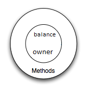

..  Copyright (C)  Brad Miller, David Ranum, Jeffrey Elkner, Peter Wentworth, Allen B. Downey, Chris
    Meyers, and Dario Mitchell.  Permission is granted to copy, distribute
    and/or modify this document under the terms of the GNU Free Documentation
    License, Version 1.3 or any later version published by the Free Software
    Foundation; with Invariant Sections being Forward, Prefaces, and
    Contributor List, no Front-Cover Texts, and no Back-Cover Texts.  A copy of
    the license is included in the section entitled "GNU Free Documentation
    License".

User Defined Classes
--------------------

We've already seen classes like ``str``, ``int``, ``float`` and ``Turtle``.  These were defined by Python and
made available for us to use.  However, in many cases when we are solving problems we need to create data objects
that are related to the problem we are trying to solve.  We need to create our own classes.

As an example, consider the concept of a checking account at a bank. An account has a current balance, a starting balance (when the last statement was generated), and a list of transactions. All these items are treated collectively as a single object. A particular account could have a current balance of 100, a starting balance of 0, and transactions of [150, -30, -20].
This is the state of that account.

Thinking about our diagram above, we could draw an ``account`` object as shown here.

A typical operation that one associates with accounts might be to ask the account for its curent balance, `getBalance``. One might wish to make a deposit to the account, ``deposit``, withdraw funds from the account, ``withdraw``, or generate a statement for it listing its transactions, ``statement``.  We'll shortly see how we can organize these together with the data.

Now that we understand what an ``account`` object might look like, we can define a new **class**. 
We'll want our accounts to each have a ``balance``, a ``start``, and a ``transactions`` attribute,
so our first class definition looks like this.

.. sourcecode:: python
    :linenos:
    
    class Account:
        """ Account class for representing and manipulating bank accounts. """
        
        def __init__(self):
            """ Create a new account with zero balance"""
            self.__balance = 0
            self.__start = 0
            self.__trans = []

Class definitions can appear anywhere in a program, but they are usually near
the beginning (after the ``import`` statements). The syntax rules for a class
definition are the same as for other compound statements. There is a header
which begins with the keyword, ``class``, followed by the name of the class,
and ending with a colon.

If the first line after the class header is a string, it becomes
the docstring of the class, and will be recognized by various tools.  (This is also the way docstrings work in functions.)

Every class should have a method with the special name ``__init__``.  
This **initializer method**, often referred to as the **constructor**, is automatically called whenever a new 
instance of ``Account`` is created.  It gives the programmer the opportunity 
to set up the attributes required within the new instance by giving them 
their initial state values.  The ``self`` parameter (you could choose any
other name, but nobody ever does!) is automatically set to reference
the newly-created object that needs to be initialized.   

So let's use our new Account class now.

.. activecode:: chp13_classes1
    
    class Account:
        """ Account class for representing and manipulating bank accounts. """
        
        def __init__(self):
            """ Create a new point at the origin """
            self.__balance = 0
            self.__start = 0
            self.__trans = []
    
    p = Account()        # Instantiate an object of type Account
    q = Account()        # and make a second Account

    print("Nothing seems to have happened with the accounts")

During the initialization of the objects, we created three
attributes called `__balance`, `__start`, and `__trans` for each, and gave each attribute a starting value.  You will note that when you run the program, nothing happens.  It turns out that this is not quite the case.  In fact, two ``Accounts`` have been created, each having their attributes initialized: zero for balance and start; an empty list for their transactions.  However, because we have not asked either account to do anything, we don't see any other result.

You can see this for yourself, via codelens:

.. codelens:: chp13_points

    class Account:
        """ Account class for representing and manipulating bank accounts. """
        
        def __init__(self):
            """ Create a new point at the origin """
            self.__balance = 0
            self.__start = 0
            self.__trans = []
    
    p = Account()        # Instantiate an object of type Account
    q = Account()        # and make a second Account

    print("Nothing seems to have happened with the accounts")

The following program adds a few print statements. You can see that the output suggests that each one is a ``Point object``.
However, notice that the ``is`` operator returns ``False`` meaning that they are different objects (we will have more to say about this in a later chapter).

.. activecode:: chp13_classes2
    
    class Account:
        """ Account class for representing and manipulating bank accounts. """
        
        def __init__(self):
            """ Create a new point at the origin """
            self.__balance = 0
            self.__start = 0
            self.__trans = []
    
    p = Account()        # Instantiate an object of type Account
    q = Account()        # and make a second Account

    print("Nothing seems to have happened with the accounts")

    print(p)
    print(q)

    print(p is q)

This should look familiar --- we've used classes before to create
more than one object:   

.. sourcecode:: python

    from turtle import Turtle    
    
    tess = Turtle()     # Instantiate objects of type Turtle   
    alex = Turtle()  
 
The variables ``p`` and ``q`` are assigned references to two new ``Account`` objects. 
A function like ``Turtle`` or ``Account`` that creates a new object instance 
is called a **constructor**.  Every class automatically uses the name of the class as the name of the constructor function.
The definition of the constructor function is done
when you write the ``__init__`` function.

It may be helpful to think of a class as a factory for making objects.  
The class itself isn't an instance of an account, but it contains the machinery 
to make account instances.   Every time you call the constructor, you're asking
the factory to make you a new object.  As the object comes off the 
production line, its initialization method is executed to 
get the object properly set up with its factory default settings.

The combined process of "make me a new object" and "get its settings initialized
to the factory default settings" is called **instantiation**.  

