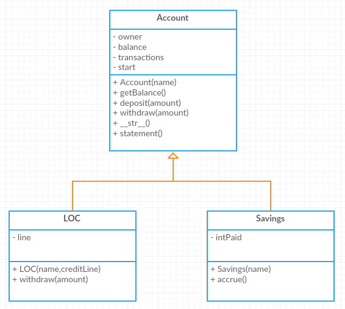

.. index:: inheritance, class; child, class; sub, class; super, class; parent

Inheritance
-----------

Often we build a class but then we need new class that is slightly different. It may need additional features or the existing behavior may need to be modified. Instead of building this new class from scratch, we can define it based on the existing similar class. 

.. important::
   **Inheritance** is the fourth principle of object-oriented programming. We define a child (or sub) class based on a parent (or super) class. The child class inherits the features, both attributes and methods, of the parent class.

.. index:: inheritance; specialization

Specialization
~~~~~~~~~~~~~~

Suppose our bank introduces a new line of credit (LOC) type account. An overdraft (negative balance) is permitted up to a specified amount. The maximum overdraft amount (line of credit) is established when the account is opened.

We start by defining LOC as a child class of Account. The name of the parent class appears in parentheses after the name of the new class.

.. activecode:: c2d
    
    class Account:
        def __init__(self):
            self.balance = 0.00

        def getBalance(self):
            return self.balance

        def deposit(self, amount):
            self.balance += amount

        def withdraw(self, amount):
            if self.balance >= amount:
                self.balance -= amount

    class LOC(Account):
        '''LOC inherits everything from Account'''

    a = LOC()
    a.deposit(100)
    print(a.getBalance())
    a.withdraw(300)
    print(a.getBalance())

At this point a LOC account operates exactly the same as a regular Account.

.. note::
   The Python version that is provided in this interactive text does not allow us have private attributes in the parent class. However, we are not so limited if we run Python locally on our own computer.

Now we modify the constructor.

.. activecode:: c2e
    
    class Account:
        def __init__(self):
            self.balance = 0.00

        def getBalance(self):
            return self.balance

        def deposit(self, amount):
            self.balance += amount

        def withdraw(self, amount):
            if self.balance >= amount:
                self.balance -= amount

    class LOC(Account):
        def __init__(self, line):
            self.__line = line
            Account.__init__(self)

    a = LOC(500)
    a.deposit(100)
    print(a.getBalance())
    a.withdraw(300)
    print(a.getBalance())

The constructor now has a parameter to specify the account's line of credit. This amount is used to initialize a new attribute, unique to the LOC account. Next the constructor asks the parent class to perform its constructor method. Notice we still cannot withdraw more than we have on deposit.

Now we modify the withdraw method.

.. activecode:: c2f
    
    class Account:
        def __init__(self):
            self.balance = 0.00

        def getBalance(self):
            return self.balance

        def deposit(self, amount):
            self.balance += amount

        def withdraw(self, amount):
            if self.balance >= amount:
                self.balance -= amount

    class LOC(Account):
        def __init__(self, line):
            self.__line = line
            Account.__init__(self)

        def withdraw(self, amount):
            '''allow overdraft up to line of credit'''
            if self.balance + self.__line >= amount:
                self.balance -= amount

    a = LOC(500)
    a.deposit(100)
    print(a.getBalance())
    a.withdraw(300)
    print(a.getBalance())
    a.withdraw(400)
    print(a.getBalance())

Both Account and LOC have a withdraw method. Both have exactly the same name. The LOC (child) withdraw **overrides** the Account (parent) withdraw. Now we can withdraw more than we have on deposit, but not more than the account's line of credit.

.. note::
   This form of inheritance is called **specialization**. The child class has an alternate way to perform an action that the parent already performs. 

.. index:: inheritance; augmentation

Augumentation
~~~~~~~~~~~~~

Now suppose our bank offers Savings accounts. This type of Account accrues (earns) interest based on its balance.

We start by saying that LOC is a child class of Account. Then we add the accrue method to pay interest.

.. activecode:: c2g
    
    class Account:
        def __init__(self):
            self.balance = 0.00

        def getBalance(self):
            return self.balance

        def deposit(self, amount):
            self.balance += amount

        def withdraw(self, amount):
            if self.balance >= amount:
                self.balance -= amount

    class Savings(Account):
        '''Savings inherits everything from Account'''
        __rate = 0.01
        def __init__(self):
            self.__intPaid = 0.0
            Account.__init__(self)
       
        def accrue(self):
            '''calculate and deposit interest'''
            interest = Savings.__rate * self.balance
            self.__intPaid += interest
            self.deposit(interest)

    a = Savings()
    a.deposit(100)
    print(a.getBalance())
    a.accrue()
    print(a.getBalance())

.. note::
   This form of inheritance is called **augmentation**. The child class has a new capability that was not available in the parent. 

.. index:: class diagram; inheritance

Class Diagram with Inheritance
~~~~~~~~~~~~~~~~~~~~~~~~~~~~~~

The arrow in this class diagram indicates inheritance. The sub-classes inherit the attributes and methods of the super-class. The sub-classes can have additional attributes or methods or they can override methods of the super-class.

