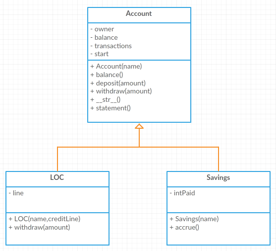

.. index:: inheritance, inheritance; augmentation

More Inheritance
----------------

Augumentation
~~~~~~~~~~~~~

Now suppose our bank offers savings accounts. This type of Account accrues (earns) interest based on 
its balance.

We start by saying that ``Savings`` is a child class of ``Account``. We add attributes for the amount 
of interest paid and the interest rate (at the class level). We also include an ``accrue`` method to 
pay interest.

.. activecode:: c2h
    
    class Account:
        def __init__(self):
            self.__balance = 0.00

        @property
        def balance(self):
            return self.__balance

        def deposit(self, amount):
            self.__balance += amount

        def withdraw(self, amount):
            if self.__balance >= amount:
                self.__balance -= amount

    class Savings(Account):
        '''Savings inherits everything from Account'''
        __rate = 0.01  #the saving account interest rate
        def __init__(self):
            self.__intpaid = 0.0
            Account.__init__(self)
       
        def accrue(self):
            '''calculate and deposit interest'''
            interest = Savings.__rate * self._Account__balance
            self.__intpaid += interest
            self.deposit(interest)

        @property
        def intpaid(self):
            return self.__intpaid
        

    a = Savings()
    a.deposit(1000)
    print('total interest:{} balance:{}'.format(a.intpaid,a.balance))
    a.accrue()
    print('total interest:{} balance:{}'.format(a.intpaid,a.balance))
    a.accrue()
    print('total interest:{} balance:{}'.format(a.intpaid,a.balance))

.. note::
   This form of inheritance is called **augmentation**. The child class has a new capability that was not 
   available in the parent. 

.. index:: class diagram; inheritance

Class Diagram with Inheritance
~~~~~~~~~~~~~~~~~~~~~~~~~~~~~~

The arrow in this class diagram indicates inheritance. The sub-classes inherit the attributes and methods 
of the super-class. The sub-classes can have additional attributes or methods or they can override methods 
of the super-class.

